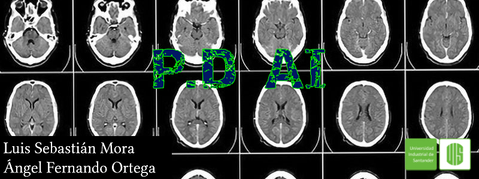

# PD-AI

link del dataset: http://fcon_1000.projects.nitrc.org/indi/retro/parkinsons.html

Este es un proyecto de inteligencia artificial que utiliza machine learning para clasficar la enfermedad de Parkinson. 

Herramientas: Python, numpy, pandas, matplotlib, seaborn, ANTsPy, sklearn

